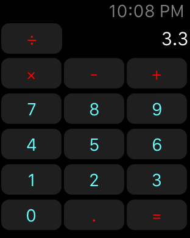
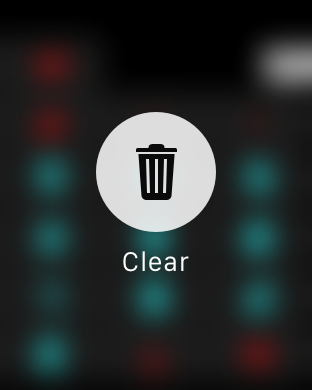

# Calculator

A proof-of-concept calculator for Apple Watch written in Swift. It's very limited for now. The idea to write this is inspired by [@BalestraPatrick](https://www.twitter.com/BalestraPatrick)'s [tweet](https://twitter.com/BalestraPatrick/status/536259176415367170).

Tap result to remove last input.

[@guanshanliu](https://twitter.com/guanshanliu)
